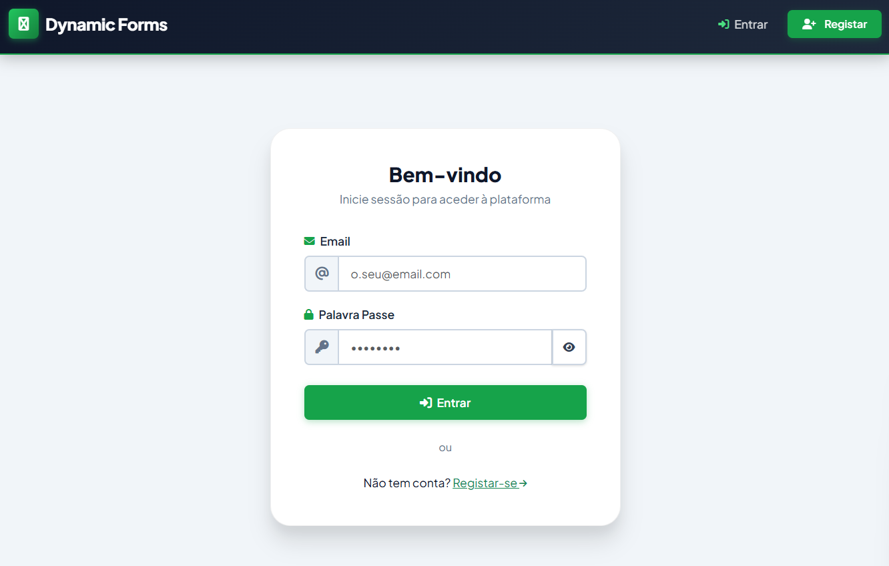
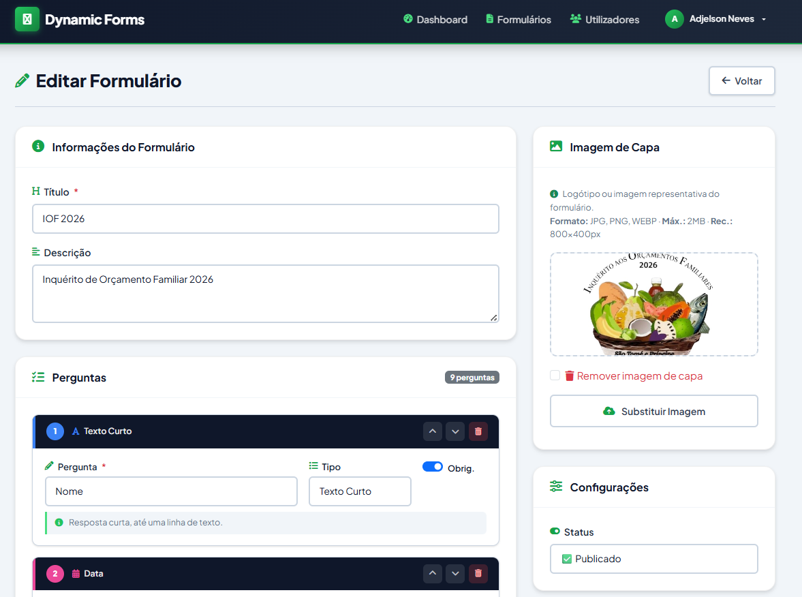
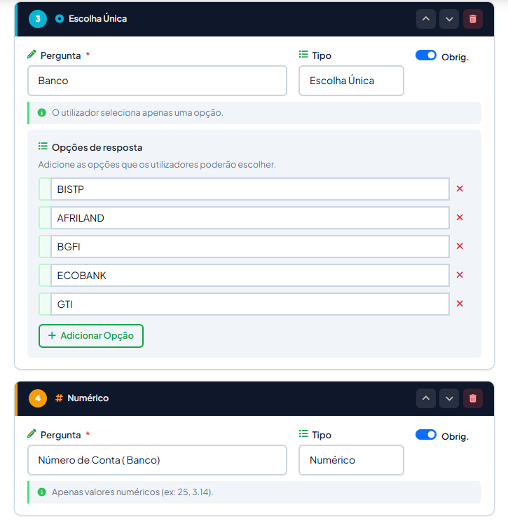
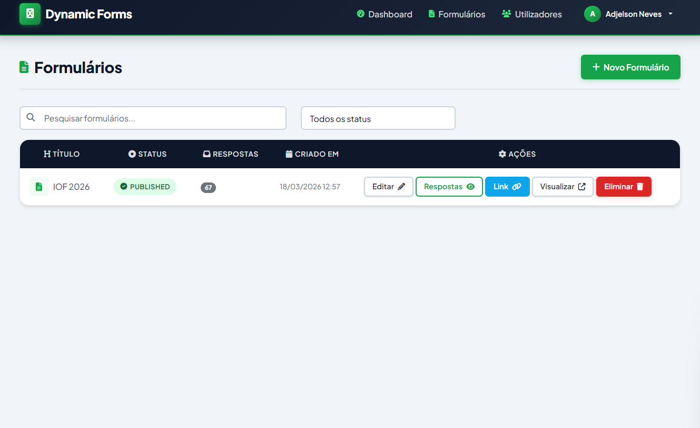
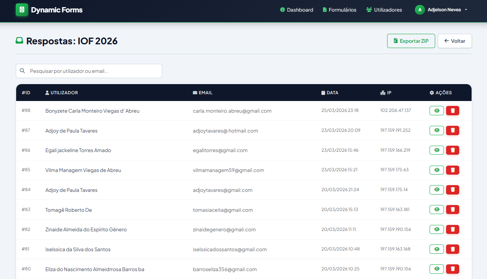
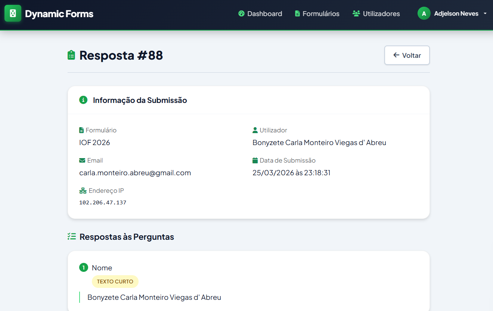
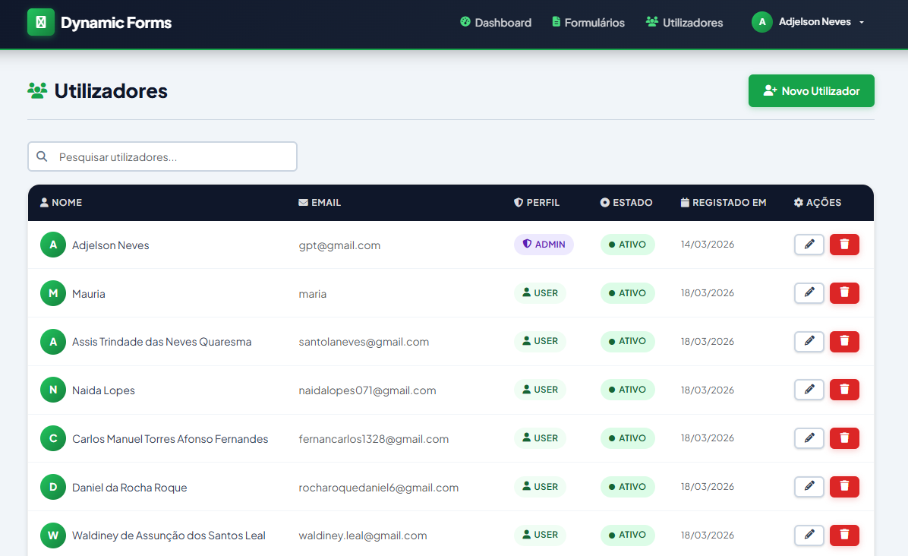

# Formulário Dinâmico

Sistema web em **PHP puro com arquitetura MVC**, criado para permitir a **criação, publicação, preenchimento, gestão e exportação de formulários dinâmicos** com controlo de utilizadores, uploads seguros e área administrativa.

Este projeto foi estruturado para dois perfis principais:

- **Administrador**: cria formulários, define perguntas, publica, acompanha respostas, exporta dados e gere utilizadores.
- **Utilizador**: regista-se, autentica-se, responde a formulários publicados, consulta o histórico e visualiza os seus próprios envios.

---

## Visão geral do sistema

O programa funciona como uma plataforma completa de recolha de dados.
O administrador monta o formulário através de um construtor dinâmico, define o tipo de cada pergunta, publica o formulário e acompanha as respostas recebidas.

O utilizador autenticado pode preencher o formulário, anexar ficheiros quando permitido, rever o histórico das suas submissões e, em alguns cenários, eliminar a sua própria resposta para preencher novamente.

### Principais capacidades

- autenticação e registo de utilizadores
- perfis separados entre **admin** e **user**
- criação de formulários com **slug público**
- construtor dinâmico de perguntas
- suporte a múltiplos tipos de campo
- upload seguro de anexos
- imagem de capa por formulário
- histórico individual de respostas
- exportação administrativa em **ZIP** e **CSV**
- proteção de ficheiros fora da pasta pública
- arquivamento lógico em tabelas `*_trash`

---

## Capturas do sistema

### Login
<p align="center">
  
</p>

### Dashboard administrativo
<p align="center">
  
</p>

### Criação de formulário
<p align="center">
  
</p>

### Tipos de perguntas
<p align="center">
  
</p>

### Preenchimento do formulário
<p align="center">
  
</p>

### Respostas recebidas
<p align="center">
  
</p>

### Histórico do utilizador
<p align="center">
  
</p>

### Gestão de utilizadores
<p align="center">
  
</p>

---

## Objetivo do projeto

O objetivo central é disponibilizar uma base sólida para sistemas de recolha de informação, inscrições, candidaturas, registos internos, inquéritos e formulários administrativos.

A aplicação foi desenhada para ser:

- simples de instalar em **XAMPP**, **Apache**, **IIS** ou ambientes PHP tradicionais;
- suficientemente flexível para suportar diferentes estruturas de formulário;
- segura no tratamento de anexos e sessão;
- fácil de manter, graças à divisão em camadas MVC.

---

## Funcionalidades detalhadas

## 1. Módulo de autenticação

Local principal:

- `app/controllers/AuthController.php`
- `app/models/User.php`
- `app/views/auth/`

O sistema permite:

- login com email e password
- registo de novos utilizadores
- criação automática de sessão segura
- redirecionamento por perfil
- preservação de rota pública quando o utilizador é obrigado a autenticar-se antes de responder a um formulário

### Fluxo

1. o utilizador tenta aceder a um formulário
2. se não estiver autenticado, é enviado para registo/login
3. após autenticação, regressa ao formulário pretendido

---

## 2. Módulo administrativo de formulários

Local principal:

- `app/controllers/FormController.php`
- `app/models/Form.php`
- `app/models/Question.php`
- `app/views/admin/forms/`
- `public/js/form-builder.js`

O administrador pode:

- criar formulários
- definir título, descrição, estado e imagem de capa
- adicionar perguntas dinamicamente
- reordenar perguntas
- editar formulários existentes
- publicar, manter em rascunho ou encerrar
- eliminar formulários com arquivamento prévio

### Estados do formulário

A tabela `forms` trabalha com os estados:

- `draft`
- `published`
- `closed`

---

## 3. Tipos de perguntas suportados

Com base no código do construtor e da renderização pública, o sistema suporta os seguintes tipos:

- `short_text`
- `long_text`
- `numeric`
- `date`
- `checkbox`
- `radio`
- `upload`

### Como cada tipo funciona

**short_text**  
campo simples de texto.

**long_text**  
área de texto para respostas longas.

**numeric**  
entrada numérica.

**date**  
seleção de data com possibilidade de `date_min` e `date_max` na configuração.

**checkbox**  
permite múltiplas seleções.

**radio**  
permite apenas uma opção.

**upload**  
permite anexar ficheiros, com validação de tamanho e formatos aceites.

### Configuração dinâmica por pergunta

O campo `config` na tabela `questions` guarda JSON com dados complementares, como por exemplo:

- lista de opções para `checkbox` e `radio`
- tipos permitidos para `upload`
- datas mínima e máxima para `date`

Exemplo de estrutura:

```json
{
  "options": ["Masculino", "Feminino"],
  "allowed_types": ["pdf", "png", "jpeg"],
  "date_min": "2026-01-01",
  "date_max": "2026-12-31"
}
```

---

## 4. Submissão e gestão de respostas

Local principal:

- `app/controllers/ResponseController.php`
- `app/models/Response.php`
- `app/models/Answer.php`
- `app/views/admin/forms/responses.php`
- `app/views/public/history.php`

### O que o sistema regista

Ao submeter um formulário, a aplicação guarda:

- referência ao formulário
- utilizador que respondeu
- endereço IP
- data/hora da submissão
- respostas individuais por pergunta
- caminho do ficheiro, quando existe upload

### Estrutura lógica

- `responses`: cabeçalho da submissão
- `answers`: respostas linha a linha

Este desenho é adequado para formulários dinâmicos porque separa a submissão do conteúdo de cada pergunta.

---

## 5. Histórico do utilizador

O utilizador comum pode:

- consultar formulários já respondidos
- abrir o detalhe de cada resposta
- visualizar ficheiros associados às suas próprias submissões
- eliminar a sua própria resposta em determinadas rotas previstas

Isso melhora a rastreabilidade individual sem expor respostas de outros utilizadores.

---

## 6. Exportação de dados

O administrador pode exportar respostas por formulário.

### Formatos previstos

- **ZIP** com:
  - `respostas.csv`
  - ficheiros de texto individuais por respondente
  - anexos enviados pelos utilizadores
- **CSV fallback** quando `ZipArchive` não estiver disponível

Local principal:

- `ResponseController::exportZip()`
- `ResponseController::exportCsvFallback()`

---

## 7. Arquivamento lógico

O sistema não se limita a apagar dados diretamente.
Antes da eliminação, certas entidades são copiadas para tabelas de arquivo:

- `forms_trash`
- `questions_trash`
- `responses_trash`
- `users_trash`

Isto é importante para auditoria, recuperação futura e proteção contra perda acidental.

---

## Arquitetura da aplicação

## Padrão utilizado

O projeto segue o padrão **MVC**:

- **Model**: acesso e manipulação de dados
- **View**: interface renderizada ao utilizador
- **Controller**: coordenação entre regras, modelos e vistas

### Mapa geral

```text
Browser
   │
   ▼
public/index.php
   │
   ▼
core/Router.php
   │
   ├── Controllers
   │     ├── AuthController
   │     ├── FormController
   │     ├── ResponseController
   │     ├── UserController
   │     ├── DownloadController
   │     ├── CoverController
   │     └── PagesController
   │
   ├── Models
   │     ├── User
   │     ├── Form
   │     ├── Question
   │     ├── Response
   │     ├── Answer
   │     └── Trash
   │
   └── Views
         ├── auth/
         ├── admin/
         ├── public/
         └── layout/
```

### Fluxo interno do pedido

```text
Pedido HTTP
   → public/index.php
   → Router
   → Controller
   → Model
   → Base de dados
   → View
   → Resposta HTML/ficheiro
```

---

## Estrutura real do projeto

```text
Formulario_Dinamico/
├── app/
│   ├── controllers/
│   │   ├── AuthController.php
│   │   ├── CoverController.php
│   │   ├── DownloadController.php
│   │   ├── FormController.php
│   │   ├── PagesController.php
│   │   ├── ResponseController.php
│   │   └── UserController.php
│   ├── models/
│   │   ├── Answer.php
│   │   ├── Form.php
│   │   ├── Question.php
│   │   ├── Response.php
│   │   ├── Trash.php
│   │   └── User.php
│   └── views/
│       ├── admin/
│       │   ├── dashboard.php
│       │   ├── forms/
│       │   └── users/
│       ├── auth/
│       ├── layout/
│       └── public/
├── config/
│   ├── config.php
│   └── database.php
├── core/
│   ├── Controller.php
│   ├── Database.php
│   ├── Model.php
│   └── Router.php
├── public/
│   ├── index.php
│   ├── css/
│   ├── js/
│   ├── .htaccess
│   └── web.config
├── storage/
│   ├── covers/
│   └── uploads/
├── imagemparaReadme/
├── dynamic_forms (1).sql
├── .htaccess
├── web.config
└── README.md
```

---

## Responsabilidade de cada camada

## Controllers

### `AuthController`
Controla login, registo, logout e criação de sessão.

### `FormController`
Gere o ciclo de vida dos formulários: dashboard, listagem, criação, edição, remoção e exibição pública.

### `ResponseController`
Recebe submissões, guarda respostas, mostra histórico e exporta resultados.

### `UserController`
Gere utilizadores pela área administrativa.

### `DownloadController`
Serve anexos privados com validação de autenticação, propriedade e MIME type.

### `CoverController`
Serve imagens de capa guardadas fora da pasta pública.

---

## Models

### `Form`
CRUD principal da tabela `forms`.

### `Question`
Guarda perguntas do formulário e respetiva configuração JSON.

### `Response`
Representa a submissão do utilizador.

### `Answer`
Representa cada resposta individual ligada a uma submissão.

### `User`
Autenticação, registo e gestão de utilizadores.

### `Trash`
Arquivamento lógico antes da eliminação definitiva.

---

## Views

As vistas estão separadas por contexto:

- `auth/`: login e registo
- `admin/`: gestão interna
- `public/`: formulários, histórico e sucesso da submissão
- `layout/`: cabeçalho e rodapé comuns

---

## Front-end e interação

A interface usa essencialmente:

- **Bootstrap**
- **Font Awesome**
- **JavaScript próprio**
- **Chart.js** para componentes gráficos do dashboard
- animações e comportamentos em `public/js/`

### Scripts relevantes

- `form-builder.js`: construtor dinâmico de perguntas
- `form-validation.js`: validação no preenchimento público
- `user-manager.js`: interações ligadas à gestão de utilizadores
- `app.js`: comportamentos gerais

---

## Base de dados

O dump incluído é:

- `dynamic_forms (1).sql`

### Tabelas principais identificadas

- `users`
- `forms`
- `questions`
- `responses`
- `answers`

### Tabelas de arquivo

- `users_trash`
- `forms_trash`
- `questions_trash`
- `responses_trash`

### Relações principais

```text
users 1 ─── N forms
users 1 ─── N responses
forms 1 ─── N questions
forms 1 ─── N responses
responses 1 ─── N answers
questions 1 ─── N answers
```

---

## Rotas principais

As rotas são registadas em `public/index.php` através de `core/Router.php`.

### Autenticação

- `/login`
- `/logout`
- `/register`

### Área pública

- `/home`
- `/forms/{slug}`
- `/forms/{slug}/submit`
- `/forms/{slug}/success`
- `/my/history`
- `/my/history/{response_id}`

### Área administrativa

- `/admin/dashboard`
- `/admin/forms`
- `/admin/forms/create`
- `/admin/forms/{id}/edit`
- `/admin/forms/{id}/responses`
- `/admin/forms/{id}/export-zip`
- `/admin/users`

### Ficheiros protegidos

- `/download/{file}`
- `/cover/{file}`

---

## Segurança implementada

O projeto já contém várias decisões corretas do ponto de vista de segurança.

### Medidas observadas

- ficheiros enviados ficam em `storage/uploads`, fora de `public`
- capas ficam em `storage/covers`, também fora de `public`
- acesso aos anexos passa por controller dedicado
- validação de autenticação e propriedade do ficheiro
- validação de MIME type no servidor
- limite de tamanho de upload
- `session.cookie_httponly`
- `session.use_strict_mode`
- `session_regenerate_id(true)` após login
- proteção por reescrita em Apache e IIS
- sanitização básica com `strip_tags()` e `trim()`

---

## Instalação

## Requisitos

- PHP 8.x
- MySQL ou MariaDB
- Apache/XAMPP ou IIS
- extensão `pdo_mysql`
- extensão `fileinfo`
- extensão `zip` recomendada para exportação ZIP

---

## Passo a passo

### 1. Copiar o projeto

Colocar a pasta do projeto dentro do servidor web.

Exemplo no XAMPP:

```text
C:\xampp\htdocs\Formulario_Dinamico
```

### 2. Criar a base de dados

Criar uma base chamada:

```sql
dynamic_forms
```

Depois importar o ficheiro:

```text
dynamic_forms (1).sql
```

### 3. Configurar `config/config.php`

Rever principalmente:

```php
define('DB_HOST', 'localhost');
define('DB_USER', 'root');
define('DB_PASS', '');
define('DB_NAME', 'dynamic_forms');
define('URLROOT', 'https://localhost/dynamic_forms');
```

> Ajuste `URLROOT` conforme a pasta e o protocolo usados no seu ambiente.

### 4. Confirmar permissões de escrita

As pastas abaixo precisam de escrita:

- `storage/uploads`
- `storage/covers`

### 5. Aceder ao sistema

Exemplo:

```text
http://localhost/Formulario_Dinamico
```

ou, dependendo da configuração local:

```text
http://localhost/dynamic_forms
```

---

## Observações técnicas importantes da análise

Durante a análise do projeto, foram identificados alguns pontos relevantes.

### 1. Há suporte a campo `date` no código, mas o SQL atual não está totalmente alinhado

O construtor (`form-builder.js`), a view pública (`form_fill.php`) e o `ResponseController` tratam o tipo `date`.
Porém, no dump SQL analisado, a coluna `questions.type` aparece com enum:

- `short_text`
- `long_text`
- `numeric`
- `checkbox`
- `radio`
- `upload`

Sem incluir `date`.

### Impacto

Se o sistema tentar guardar uma pergunta do tipo `date` numa base com esse enum antigo, haverá inconsistência.

### Recomendação

Atualizar a estrutura da tabela `questions` para incluir `date` no enum, ou migrar esse campo para `varchar` controlado pela aplicação.

---

### 2. Existem ficheiros duplicados de `Router`

Foram encontrados:

- `core/Router.php`
- `Router.php` na raiz

O sistema usa `core/Router.php` no `public/index.php`.
O ficheiro da raiz aparenta ser redundante e pode gerar confusão de manutenção.

### Recomendação

Manter apenas uma implementação oficial do roteador.

---

### 3. A pasta `core/app/` parece residual

Existe uma estrutura adicional em `core/app/` que não participa no fluxo normal principal.

### Recomendação

Verificar se é legado antigo e remover se não estiver em uso.

---

### 4. O ZIP do projeto inclui `.git`, uploads e dados de exemplo

Na análise do pacote, o projeto contém:

- pasta `.git`
- ficheiros em `storage/uploads`
- imagens em `storage/covers`
- dump SQL com dados de exemplo

### Recomendação

Para distribuição profissional ou produção:

- remover `.git` do pacote final
- não distribuir uploads reais de utilizadores
- disponibilizar uma base limpa sem dados sensíveis
- manter apenas ficheiros necessários à instalação

---

## Pontos fortes do projeto

- arquitetura MVC clara
- boa separação entre lógica, dados e interface
- roteador próprio simples e funcional
- formulário realmente dinâmico
- exportação administrativa útil
- tratamento de anexos fora da webroot
- histórico por utilizador
- suporte a ambiente Apache e IIS

---

## Melhorias recomendadas para próximas versões

- normalizar completamente o suporte ao tipo `date` no SQL
- implementar CSRF token em todos os formulários POST
- reforçar validação server-side por tipo de pergunta
- adicionar paginação nas listagens administrativas
- criar logs de auditoria de ações do admin
- permitir duplicar formulários existentes
- criar filtros por estado, data e utilizador nas respostas
- substituir mensagens `die()` por tratamento de erro amigável
- criar instalador inicial ou ficheiro `.env`

---

## Resumo técnico

Este projeto já está num nível muito bom para servir como base de:

- sistema de inscrições
- plataforma de recolha de dados
- formulários administrativos internos
- cadastro de utilizadores com anexos
- inquéritos ou candidaturas online

A base arquitetural é consistente, o fluxo de utilização é claro e a organização do código permite evolução futura com relativa facilidade.

---

## Licença e uso

Defina aqui a licença do projeto conforme a forma de distribuição pretendida.
Se for um projeto privado, recomenda-se acrescentar uma nota explícita de uso interno ou proprietário.

